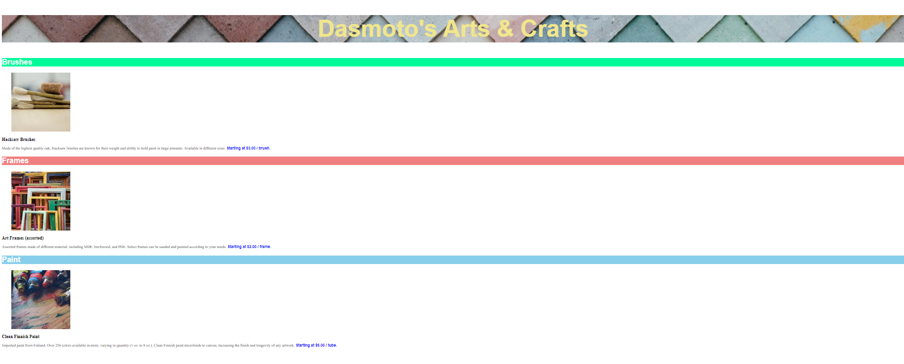

# Project Name

> Very simple website for a fictional arts and crafts store.

## Table of Contents

- [General Info](#general-information)
- [Screenshots](#screenshots)
- [Project Status](#project-status)
- [Acknowledgements](#acknowledgements)
- [Contact](#contact)

## General Information

- Simple project that required only html and css.
- Followed a design spec to complete it.

## Screenshots

## Project Status

Project is: _complete_

## Acknowledgements

Give credit here.

- This project was inspired by...codecademy

## Contact

Created by Boris Pavel - feel free to contact me!
